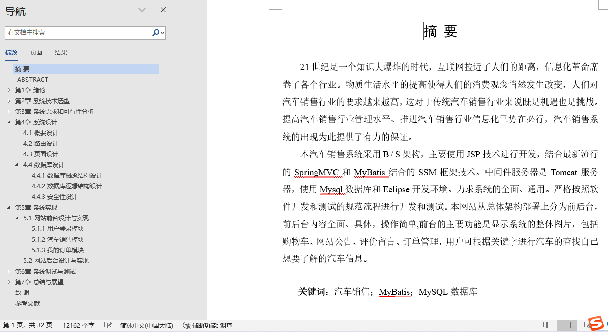
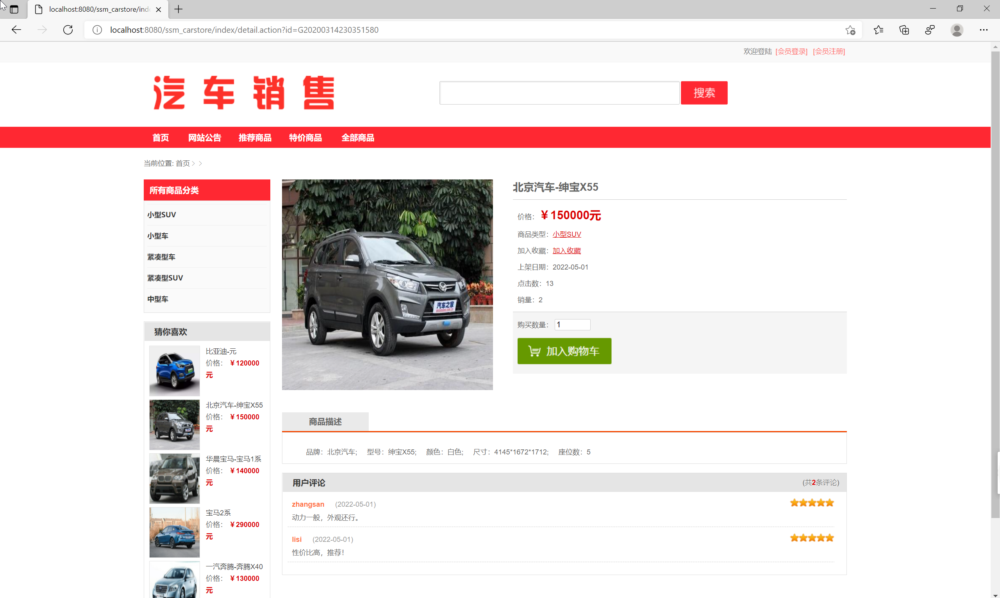
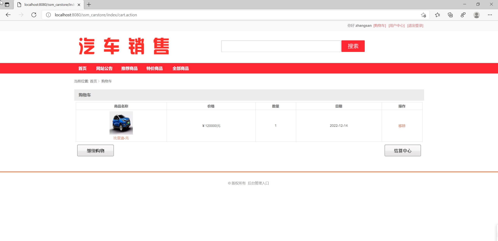
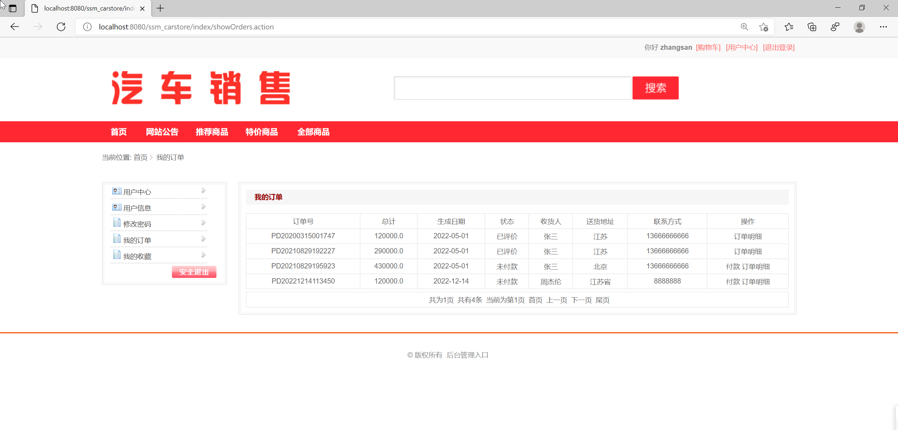
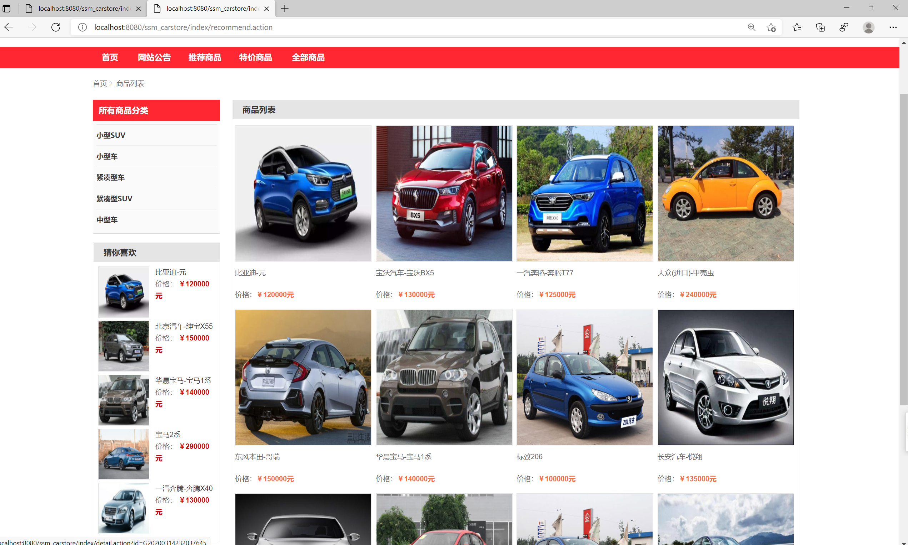
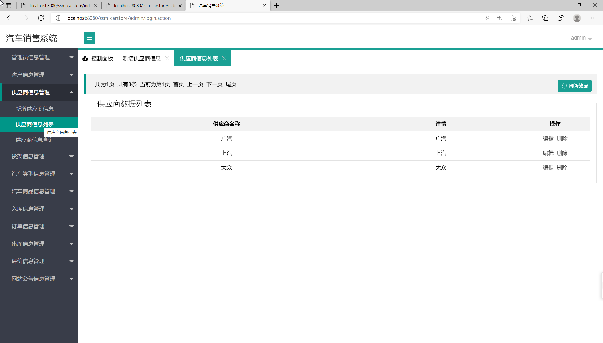
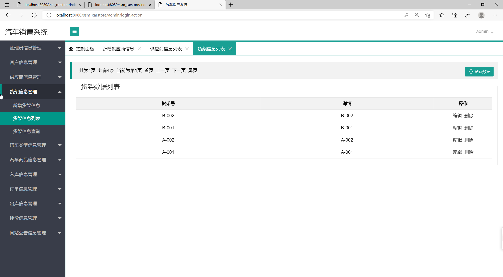
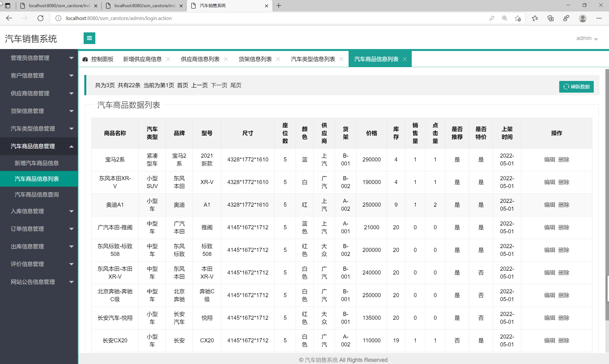
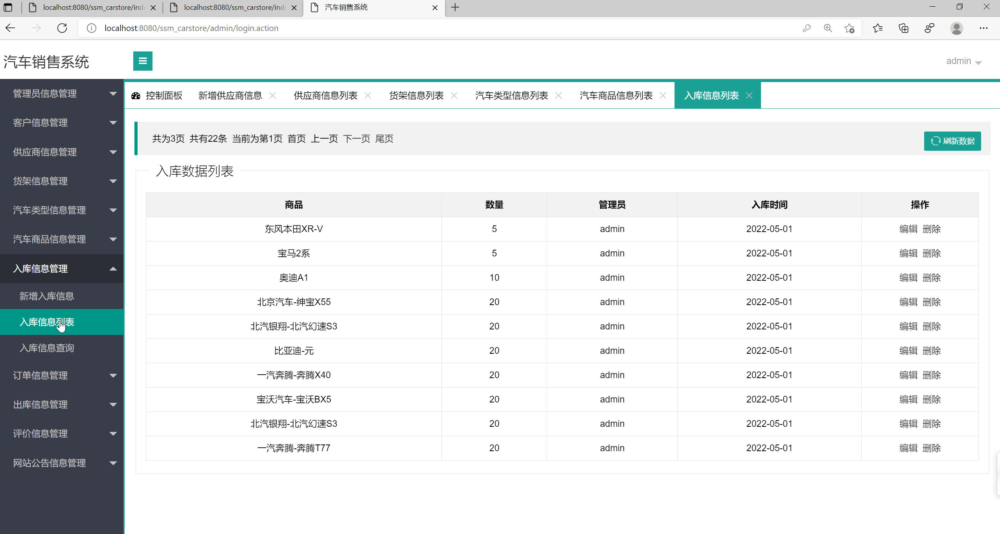
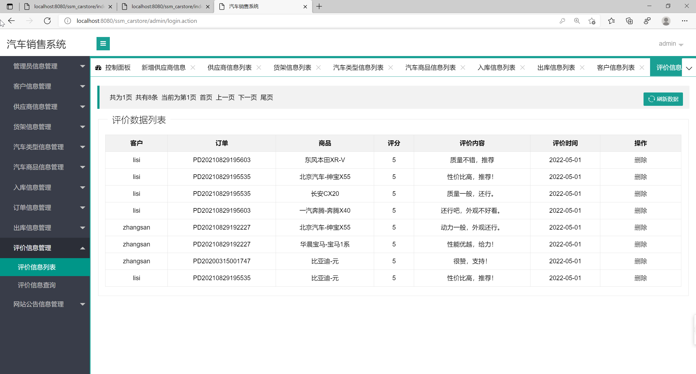

## 基于SSM框架的汽车销售系统(程序+报告)

- <b>完整代码获取地址：从戎源码网 ([https://armycodes.com/](https://armycodes.com/))</b>
- <b>技术探讨、资料分享，请加QQ群：692619798</b> 
- <b>作者微信：19941326836  QQ：952045282</b> 
- <b>承接计算机毕业设计、Java毕业设计、Python毕业设计、深度学习、机器学习</b>
- <b>选题+开题报告+任务书+程序定制+安装调试+论文+答辩ppt 一条龙服务</b>
- <b>所有选题地址 ([https://github.com/YuLin-Coder/AllProjectCatalog](https://github.com/YuLin-Coder/AllProjectCatalog)) </b>

## 项目介绍
基于SSM框架的汽车销售系统，有用户和管理员两个角色，
1. 网站前台模块：
- 汽车浏览：用户可以浏览系统中的汽车信息
- 个人信息管理：用户可以注册、登录并管理个人信息
- 购物车：用户可以将感兴趣的汽车添加到购物车，并进行管理，包括选择数量、删除、提交订单等。
- 订单中心：用户可以查看和管理自己的订单，包括订单状态、付款、发货等。
- 评论留言：用户可以对购买过的汽车进行评价和留言，供其他用户参考。
- 网站公告：用户可以查看系统发布的最新公告和促销活动信息等。

2. 管理员后台模块：
- 管理员信息管理：管理员可以添加、编辑和删除管理员的基本信息，包括用户名、密码、权限等。
- 客户信息管理：管理员可以查看和管理用户的基本信息，包括用户名、联系方式、订单记录等。
- 供应商信息管理：管理员可以添加、编辑和删除供应商的基本信息，包括供应商名称、联系方式、合作协议等。
- 汽车类型管理：管理员可以添加、编辑和删除汽车的类型信息，包括汽车品牌、车系、级别等。
- 汽车信息管理：管理员可以添加、编辑和删除汽车的详细信息，包括型号、颜色、价格、库存等。
- 入库信息管理：管理员可以记录汽车的入库信息，包括供应商、入库时间、数量等。
- 订单信息管理：管理员可以查看和管理用户的订单信息，包括订单状态、付款、发货等。
- 出库信息管理：管理员可以记录汽车的出库信息，包括购买用户、出库时间、数量等。
- 评价信息管理：管理员可以查看和管理用户对汽车的评价和留言，包括审核、回复等。
- 网站公告管理：管理员可以发布、编辑和删除网站的公告和促销活动信息等。

## 项目技术
- 编程语言：Java
- 数据库：MySQL
- 前端技术：JSP、JavaScript、jquery
- 后端技术：Spring、SpringMVC、MyBatis

## 运行环境
- JDK版本：JDK1.8及以上
- 开发工具：IDEA、Ecplise、Myecplise都可以
- 数据库: MySQL5.7及以上

## 运行截图

